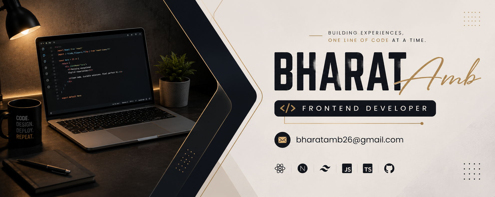

  

  <h1>Hi 👋, I'm Bharat Jatav</h1>
  <h3>Frontend Developer | React.js | Next.js | TypeScript</h3>

  

    <b>💼 2+ Years Exp</b> &nbsp;|&nbsp;
    <b>⚛️ React & Next.js Specialist</b> &nbsp;|&nbsp;
    <b>📍 Gwalior, India</b>
  

  

    <code><b>Commercial CRM</b></code> &nbsp;•&nbsp;
    <code><b>EduHR (HRMS)</b></code> &nbsp;•&nbsp;
    <code><b>Multi-Institute EdTech</b></code> &nbsp;•&nbsp;
    <code><b>E-Commerce</b></code>
  

  

    

  

  
  

---

## 👨‍💻 About Me

* 💼 **Frontend Developer** with **2+ years** of hands-on experience in building performant, scalable web applications[cite: 1].
* ⚛️ Specialized in **React.js**, **Next.js**, **TypeScript**, and **Tailwind CSS**[cite: 1].
* 🚀 Track record shipping production commercial products: **Enterprise CRM**, **EduHR (HRMS)**, **Multi-Institute EdTech**, and **Healthcare E-Commerce**[cite: 1].
* 🔥 Core expertise in custom hooks, state management, REST API integrations, TanStack Query, and RBAC[cite: 1].
* 🌱 Currently mastering **System Design**, **Web Performance Optimization**, and **Next.js App Router Architecture**.
* 📍 Open for exciting Frontend and Full-Stack opportunities!

 

---

## 🛠 Tech Stack & Tools

---

## 💼 Work Experience

<table>
  <tr>
    <td width="50%" valign="top">
      <h3>🚀 Frontend Developer</h3>
      
<b>Educerns Technologies Pvt Ltd</b> • <i>Aug 2025 – Present</i>

      <ul>
        <li><b>Enterprise CRM:</b> Engine for GST calculations, dynamic quotation/invoice PDFs, and client inventory modules[cite: 1].</li>
        <li><b>EduHR:</b> Onboarding workflows, attendance dashboard, Role-Based Access Control (RBAC), and centralized UI component library[cite: 1].</li>
        <li><b>EduSkill & EduTax:</b> Interactive faculty/student portals, document uploads, and automated error handling layers[cite: 1].</li>
      </ul>
    </td>
    <td width="50%" valign="top">
      <h3>🚀 Frontend Developer</h3>
      
<b>Aigetai Pvt Ltd</b> • <i>Oct 2024 – Aug 2025</i>

      <ul>
        <li>Built healthcare e-commerce platform with vendor dashboard, cart checkout, and Google Maps API[cite: 1].</li>
      </ul>
      

      <h3>🚀 Full Stack Intern</h3>
      
<b>Numeric Infosystem Pvt Ltd</b> • <i>Mar 2024 – Sept 2024</i>

      <ul>
        <li>Engineered cross-platform web and mobile modules using React, Node.js, MySQL, and React Native[cite: 1].</li>
      </ul>
    </td>
  </tr>
</table>

---

## 🚀 Key Production Projects

| Project | Type | Core Highlights |
| :--- | :---: | :--- |
| **🏢 Commercial Enterprise CRM** | Company Production | Master data modules, lead-management tracking, GST calculation engine, inventory reporting across warehouses, dynamic PDF generation, and Excel export (SheetJS)[cite: 1]. |
| **👥 EduHR — HR & Employee Platform** | Company Production | Employee onboarding workflows, real-time attendance management, custom-hook-based Role-Based Access Control (RBAC), and shared UI component library[cite: 1]. |
| **🎓 Multi-Institute EduPlatform** | Commercial Client | Multi-institute portal supporting course management, teacher content creation, notes distribution, and multi-tier role-based UI access active across 3+ institutes[cite: 1]. |
| **📊 Interactive Static Dashboard** | Open Showcase | Feature-packed frontend dashboard with dynamic UI widgets and analytics.  👉 [<kbd> Live Dashboard </kbd>](https://dashboard-nrsd.onrender.com/) |

---

💬 *"Building scalable, modern web applications with precision."*  
<b>⭐ If you like my work, feel free to star the repo or drop a follow!</b>

